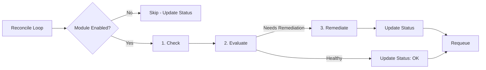
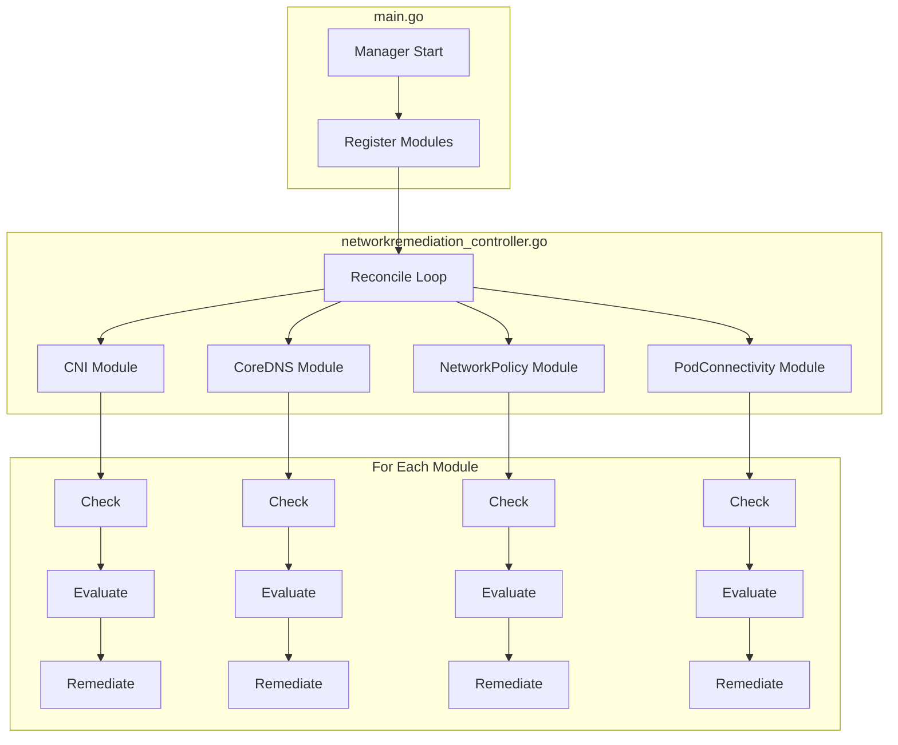

# Network Remediation Operator - Architecture Guide

This document explains the architecture of the network remediation operator for the team. Read this before implementing your module.

## Overview

This operator monitors and auto-heals networking failures in a Kubernetes cluster. It covers four types of failures:

| Module | Failure Type | 
|--------|-------------|
| **CNI** | CNI plugin crashes, IPAM exhaustion |
| **CoreDNS** | DNS latency, failure, misconfiguration |
| **NetworkPolicy** | Policy drift, enforcement gaps |
| **PodConnectivity** | Pod isolation, cross-node failures |

All four modules run inside a single operator binary. There is one Custom Resource Definition (CRD) - `NetworkRemediation` - that configures all modules through a single CR instance.

## Check → Evaluate → Remediate Pipeline

Every module follows the same 3-phase pipeline. This pattern is the core runtime model of the operator.



### Phase 1: Check

**Purpose**: Gather raw signals. No decisions are made here.

Examples:
- CNI: List pods stuck in `ContainerCreating`, check calico-node DaemonSet status
- CoreDNS: Query Prometheus for DNS latency, perform DNS probe
- NetworkPolicy: List current policies, compare against snapshots
- PodConnectivity: Run ping/HTTP probes between pods on different nodes

**Input**: The `NetworkRemediationSpec` (your module's section)
**Output**: `CheckResult` with a `Signals` map

### Phase 2: Evaluate

**Purpose**: Analyze the signals to decide if there's actually an issue.

This phase exists to:
- **Avoid false positives** - A single failed probe doesn't mean the network is broken
- **Classify severity** - Is this informational, a warning, or critical?
- **Decide if action is needed** - Some issues are detected but don't need automated remediation

**Input**: `CheckResult` from the Check phase
**Output**: `EvalResult` with `IsHealthy`, `NeedsRemediation`, `Reason`, `Severity`

### Phase 3: Remediate

**Purpose**: Execute the corrective action. Only runs when Evaluate says `NeedsRemediation=true`.

Examples:
- CNI: Restart calico-node pod, taint node
- CoreDNS: Scale deployment back up, switch upstream DNS
- NetworkPolicy: Reapply deleted policy from snapshot
- PodConnectivity: Restart CNI agent on affected node

**Input**: `EvalResult` from the Evaluate phase
**Output**: `RemediateResult` with `Action`, `Success`

## Module Interface

Every module must implement this interface (defined in `pkg/module/module.go`):

```go
type Module interface {
    Name() string
    Check(ctx context.Context, spec *NetworkRemediationSpec) (*CheckResult, error)
    Evaluate(ctx context.Context, checkResult *CheckResult) (*EvalResult, error)
    Remediate(ctx context.Context, evalResult *EvalResult) (*RemediateResult, error)
}
```

**DO NOT modify this interface**  it's the contract between the dispatcher and all modules.

## How It All Fits Together



The dispatcher (`internal/controller/networkremediation_controller.go`):
1. Fetches the `NetworkRemediation` CR
2. Iterates through registered modules
3. Skips disabled modules
4. Runs Check → Evaluate → Remediate for enabled modules
5. Updates per-module status in the CR
6. Requeues for periodic re-check

## How to Implement Your Module

### Step 1: Navigate to your module

Your code lives in `internal/controller/<module>/controller.go`. The stub is already there with TODO comments.

### Step 2: Add CRD spec fields

Edit your module's dedicated types file in `api/v1alpha1/` and add fields to your module's spec struct:
- CNI: `api/v1alpha1/cni_types.go` (`CNISpec`)
- CoreDNS: `api/v1alpha1/coredns_types.go` (`CoreDNSSpec`)
- NetworkPolicy: `api/v1alpha1/networkpolicy_types.go` (`NetworkPolicySpec`)
- PodConnectivity: `api/v1alpha1/podconnectivity_types.go` (`PodConnectivitySpec`)

Examples of fields you might add:
- Thresholds (latency, failure rate, usage percentage)
- Intervals (how often to check)
- Feature toggles (enable/disable specific sub-checks)
- Target resources (DaemonSet name, deployment name, namespaces)

After adding fields, run:

```bash
make manifests   # Regenerate CRD YAML
make generate    # Regenerate DeepCopy methods
```

### Step 3: Implement Check()

Add the logic to gather health signals. Use the Kubernetes client (`m.Client`) to query pod statuses, deployment states, etc. Store results in the `Signals` map:

```go
func (m *CNIModule) Check(ctx context.Context, spec *...) (*module.CheckResult, error) {
    signals := map[string]any{}
    
    // Example: check for stuck pods
    podList := &corev1.PodList{}
    m.Client.List(ctx, podList, ...)
    signals["stuckPodCount"] = countStuck(podList)
    
    return &module.CheckResult{Signals: signals}, nil
}
```

### Step 4: Implement Evaluate()

Analyze the signals and decide if remediation is needed:

```go
func (m *CNIModule) Evaluate(ctx context.Context, check *module.CheckResult) (*module.EvalResult, error) {
    stuckCount := check.Signals["stuckPodCount"].(int)
    
    if stuckCount > 0 {
        return &module.EvalResult{
            IsHealthy:        false,
            NeedsRemediation: true,
            Reason:           fmt.Sprintf("%d pods stuck in ContainerCreating", stuckCount),
            Severity:         "critical",
        }, nil
    }
    
    return &module.EvalResult{IsHealthy: true, Reason: "All pods healthy"}, nil
}
```

### Step 5: Implement Remediate()

Execute the fix:

```go
func (m *CNIModule) Remediate(ctx context.Context, eval *module.EvalResult) (*module.RemediateResult, error) {
    // Restart the calico-node pod on the affected node
    err := m.Client.Delete(ctx, calicoNodePod)
    if err != nil {
        return &module.RemediateResult{Action: "restart calico-node", Success: false, Err: err}, nil
    }
    return &module.RemediateResult{Action: "restarted calico-node on node-2", Success: true}, nil
}
```

### Step 6: Add RBAC markers

If your module needs to access Kubernetes resources (pods, deployments, configmaps, etc.), add RBAC markers in your controller file:

```go
// +kubebuilder:rbac:groups="",resources=pods,verbs=get;list;watch;delete
// +kubebuilder:rbac:groups=apps,resources=daemonsets,verbs=get;list;watch
```

Then run `make manifests` to regenerate the RBAC rules.

### Step 7: Write tests

Add tests in `internal/controller/<your-module>/controller_test.go`:

```go
func TestCNIModule_Check(t *testing.T) {
    // Test that Check() correctly detects stuck pods
}

func TestCNIModule_Evaluate(t *testing.T) {
    // Test that Evaluate() correctly classifies issues
}

func TestCNIModule_Remediate(t *testing.T) {
    // Test that Remediate() calls the right K8s APIs
}
```

Run tests:

```bash
# All tests
make test

# Your module's tests only
go test ./internal/controller/cni/... -v
```

## Project Structure

```
operator/
├── cmd/main.go                                    # Entrypoint - registers modules with manager
├── api/v1alpha1/
│   ├── networkremediation_types.go                # Top-level CRD, Spec, Status (SHARED)
│   ├── cni_types.go                               # ← Team member 1 (CNISpec)
│   ├── coredns_types.go                           # ← Team member 2 (CoreDNSSpec)
│   ├── networkpolicy_types.go                     # ← Team member 3 (NetworkPolicySpec)
│   └── podconnectivity_types.go                   # ← Team member 4 (PodConnectivitySpec)
├── pkg/module/
│   └── module.go                                  # Module interface (DO NOT MODIFY)
├── internal/controller/
│   ├── networkremediation_controller.go           # Dispatcher (DO NOT MODIFY)
│   ├── cni/controller.go                          # ← Team member 1
│   ├── coredns/controller.go                      # ← Team member 2
│   ├── networkpolicy/controller.go                # ← Team member 3
│   └── podconnectivity/controller.go              # ← Team member 4
└── config/
    ├── crd/bases/                                 # Generated CRD YAML
    ├── rbac/                                      # Generated RBAC
    └── samples/                                   # Sample CR
```

## Collaboration Rules

1. **Work in your own files** - Each module has its own controller in `internal/controller/<module>/` AND its own types file in `api/v1alpha1/<module>_types.go`. This minimizes git merge conflicts!
2. **Top-level CRD types are shared** - `networkremediation_types.go` holds the parent spec and status. Avoid changing it unless adding top-level fields.
3. **Don't modify the interface** - `pkg/module/module.go` is the contract. Changing it breaks all modules.
4. **Don't modify the dispatcher** - `networkremediation_controller.go` is stable. If you need changes, discuss with the team.
5. **Always regenerate after type changes** - Run `make manifests && make generate` after editing your `_types.go`.
6. **Run tests before pushing** - `make test` must pass before you push.
