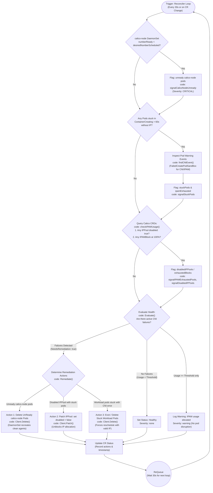

# CNI Failure Modes, Remediation Policy & Code Architecture

This document provides a comprehensive, 1-to-1 mapping between:
1. **The exact CNI failure issues** observed in production Kubernetes clusters.
2. **The visual remediation workflow diagram** (decision tree and execution loop).
3. **The exact Go code implementation** in [`operator/internal/controller/cni/controller.go`](../internal/controller/cni/controller.go).

---

## 1. The Core Issues: What Breaks & Why Kubernetes Fails

Kubernetes relies on the CNI plugin (Calico) to allocate IP addresses, configure network namespaces, and establish BGP routing mesh. When the CNI breaks, Kubernetes enters an operational **blind spot**.

```
┌────────────────────────────────────────────────────────────────────────┐
│                        KUBERNETES DEFAULT VIEW                         │
│ Node Status: Ready | Pod Phase: Pending or Running | Scheduler: Normal │
└───────────────────────────────────┬────────────────────────────────────┘
                                    │
                         BLIND TO NETWORK FAILURES
                                    │
┌───────────────────────────────────▼────────────────────────────────────┐
│                       ACTUAL CNI LAYER FAILURE                         │
│                                                                        │
│ 1. calico-node agent crashed / unready (BGP routing mesh down)         │
│ 2. IPAM IP pool exhausted (100% full, no IP available for new pods)    │
│ 3. Calico IPPool disabled (spec.disabled = true)                       │
│ 4. Workload pods permanently stuck in ContainerCreating                │
└────────────────────────────────────────────────────────────────────────┘
```

---

### Issue 1: `calico-node` DaemonSet Crash or Unreadiness
* **Real-World Cause:** The `calico-node` agent pod crashes, hangs on readiness checks, or loses BGP socket connectivity (`/var/run/calico/bird.ctl`).
* **Symptoms:**
  - Pod status shows `0/1 Running` or `CrashLoopBackOff` in `kube-system`.
  - BGP peering with peer nodes drops. Cross-node traffic fails with timeouts (`status=000 | latency=5000ms+`).
  - Kubelet fails to configure networking for any new pod scheduled on that node.
* **Why K8s Fails to Self-Heal:** Kubelet only checks its own runtime health. As long as kubelet is alive, the node stays `Ready`. Kubernetes does not monitor pod-to-pod routing health, leaving workloads stranded on broken nodes indefinitely.

---

### Issue 2: IPAM Pool Exhaustion (No Free IPs)
* **Real-World Cause:** A subnet or IP pool is sized too small (e.g. `/28` with only 14 usable host IPs). Workload scaling causes all allocations in Calico's `IPAMBlock` CRDs to become occupied.
* **Symptoms:**
  - New pods are scheduled by Kubernetes onto a node, but remain stuck in `Pending` / `ContainerCreating` indefinitely with no IP (`pod.status.podIP == ""`).
  - Kubelet event log:
    ```text
    Warning FailedCreatePodSandBox: plugin type="calico" failed (add): failed to request IPv4 addresses: 
    Assigned 0 out of 1 requested IPv4 addresses; No IPs available in pools: [10.200.0.0/28]
    ```
* **Why K8s Fails to Self-Heal:** The default Kubernetes scheduler has **zero awareness of IPAM capacity**. It blindly assigns pods to nodes that have zero available IP addresses.

---

### Issue 3: Inadvertently Disabled Calico IPPool
* **Real-World Cause:** An administrator or migration script sets `spec.disabled: true` on an IPPool (e.g. `default-ipv4-ippool`) without activating a secondary pool.
* **Symptoms:**
  - Calico CNI plugin rejects all new sandbox allocation requests.
  - All new pods cluster-wide fail with `No IPs available in pools`.
* **Why K8s Fails to Self-Heal:** Kubernetes allows arbitrary updates to CRDs and does not detect that pod provisioning is blocked due to the disabled pool.

---

## 2. Operator Remediation Policy: Complete Workflow Diagram

Below is the workflow matching the implementation in `operator/internal/controller/cni/controller.go`.



---

## 3. Exact 1-to-1 Code Mapping

Every decision and action in the workflow diagram maps directly to a specific function in [`operator/internal/controller/cni/controller.go`](../internal/controller/cni/controller.go):

### Step 1: `Check()` Phase - Raw Signal Gathering
In `Check(ctx context.Context, spec *remediationv1alpha1.NetworkRemediationSpec)`:

| Diagram Step | Code Function & Location | How It Works |
|---|---|---|
| **Check calico-node DaemonSet** | [`checkCalicoDaemonSet()`](../internal/controller/cni/controller.go#L177-L220) | Reads DaemonSet `status.desiredNumberScheduled` vs `status.numberReady`. If mismatched, lists pods with label `k8s-app=calico-node` and checks `isPodReady()`. Unready pod names stored in `signalCalicoNodeUnready`. |
| **Check Stuck Workload Pods** | [`checkStuckPods()`](../internal/controller/cni/controller.go#L222-L269) | Scans all cluster pods in `PodPending` phase with empty `PodIP`. Checks if `time.Since(creationTimestamp) > StuckPodThresholdSeconds` (default 60s). |
| **Inspect Pod Warning Events** | [`findCNIEvent()`](../internal/controller/cni/controller.go#L271-L318) | Queries Kubernetes `EventList` for `FailedCreatePodSandBox`. Performs case-insensitive matching for `"failed to setup network"`, `"no ips available in pools"`, `"failed to allocate"`. Stores in `signalStuckPods`. |
| **Check Calico IPAM Blocks & IPPools** | [`checkIPAMUsage()`](../internal/controller/cni/controller.go#L320-L386) | Queries Calico's `IPPoolList` to detect `spec.disabled == true`. Queries `IPAMBlockList` to calculate `used / total` IP slots per block CIDR. Stores in `signalIPAMExhaustedPools` and `signalDisabledIPPools`. |

---

### Step 2: `Evaluate()` Phase - Heuristic Decision Engine & Action Planning
In `Evaluate(ctx context.Context, checkResult *module.CheckResult)` ([`controller.go#L388-L500`](../internal/controller/cni/controller.go#L388-L500)):

```go
// 1. Calico-node crash -> Plan: ActionRestartCalicoNode
if len(unreadyPods) > 0 {
    m.pendingTarget = &remediationTarget{
        actionType:  ActionRestartCalicoNode,
        unreadyPods: unreadyPods,
    }
    return &module.EvalResult{
        IsHealthy: false, NeedsRemediation: true, Severity: "critical",
        Reason: fmt.Sprintf("%d calico-node pod(s) not ready...", len(unreadyPods)),
    }, nil
}

// 2. Disabled IPPool with stuck pods -> Plan: ActionReenableIPPool
if len(disabledPools) > 0 && (len(stuckPods) > 0 || hasIPAMStuck(stuckPods)) {
    m.pendingTarget = &remediationTarget{
        actionType:    ActionReenableIPPool,
        disabledPools: disabledPools,
        stuckPods:     stuckPods,
    }
    return &module.EvalResult{
        IsHealthy: false, NeedsRemediation: true, Severity: "critical",
        Reason: fmt.Sprintf("Calico IPPool(s) disabled [%s]...", strings.Join(disabledPools, ", ")),
    }, nil
}

// 3. IPAM exhaustion / stuck workloads -> Plan: ActionEvictStuckPods
if len(exhaustedPools) > 0 || len(stuckPods) > 0 {
    m.pendingTarget = &remediationTarget{
        actionType: ActionEvictStuckPods,
        stuckPods:  stuckPods,
    }
    return &module.EvalResult{
        IsHealthy: false, NeedsRemediation: true, Severity: severity,
        Reason: "...",
    }, nil
}
```

---

### Step 3: `Remediate()` Phase - Targeted Branching Recovery
In `Remediate(ctx context.Context, evalResult *module.EvalResult)` ([`controller.go#L506-L620`](../internal/controller/cni/controller.go#L506-L620)):

The controller executes **only** the selective branch matching the detected failure via `switch actionType`:

```go
switch actionType {
case ActionRestartCalicoNode:
    // TARGETED ACTION 1: Restart unready calico-node pods only
    for _, podName := range unreadyPods {
        pod := &corev1.Pod{ObjectMeta: metav1.ObjectMeta{Name: podName, Namespace: "kube-system"}}
        _ = m.Client.Delete(ctx, pod)
    }

case ActionReenableIPPool:
    // TARGETED ACTION 2: Re-enable the specific disabled IPPools and evict waiting pods
    for _, poolName := range disabledPools {
        // Patches spec.disabled = false ONLY on the targeted disabled IPPool(s)
        _ = m.Client.Patch(ctx, patch, client.MergeFrom(pool))
    }
    for _, sp := range stuckPods {
        _ = m.Client.Delete(ctx, pod)
    }

case ActionEvictStuckPods:
    // TARGETED ACTION 3: Evict stuck workload pods only
    for _, sp := range stuckPods {
        pod := &corev1.Pod{ObjectMeta: metav1.ObjectMeta{Name: sp.Name, Namespace: sp.Namespace}}
        _ = m.Client.Delete(ctx, pod)
    }
}
```

---

## 4. Policy Summary Matrix

| Failure Scenario | Signal Detected in Code | Evaluation Severity | Automated Remediation Function |
|---|---|---|---|
| **calico-node pod crash / BGP down** | `signalCalicoNodeUnready` | `critical` | `Client.Delete()` on unready `calico-node` pods |
| **Disabled IPPool with stuck pods** | `signalDisabledIPPools` + `signalStuckPods` | `critical` | `Client.Patch()` setting `spec.disabled = false` |
| **IPAM address pool exhaustion** | `signalIPAMExhaustedPools` (100% usage) | `critical` | `Client.Delete()` on stuck workload pods to reschedule |
| **Isolated sandbox creation timeout** | `signalStuckPods` (> 60s without IP) | `warning` | `Client.Delete()` on stuck pods for clean sandbox retry |
| **Elevated IP pool usage (>= Threshold%)** | `signalIPAMUsageByPool >= IPAMUsageThresholdPercent` (default 80%) | `warning` | Emits capacity warning log (no disruptive restart). Configured via `spec.cni.ipamUsageThresholdPercent`. |
| **Cluster healthy** | 0 unready, 0 stuck, usage < Threshold% | `none` | Updates status `Healthy = true`, sleeps until next cycle |
