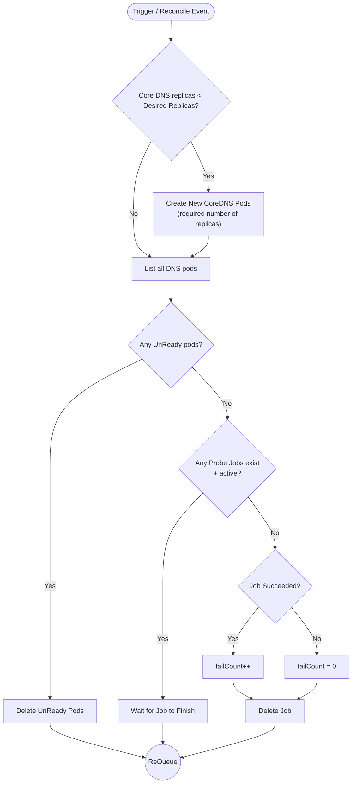

# CoreDNS Module: Failure Modes & Remediation Policy Guide

This document provides a comprehensive explanation of the CoreDNS health monitoring and remediation module within the **Network Remediation Operator**. It outlines the specific DNS failure scenarios handled by the operator, why native Kubernetes mechanisms fail to recover from them, and details the exact **Remediation Policy & Operator Workflow**.

---

## 1. Overview of CoreDNS Failure Modes

CoreDNS is the foundational DNS server for Kubernetes service discovery. While Kubernetes manages container lifecycles, it lacks application-level DNS monitoring and fails to recover from silent degradation, misconfigurations, or scaling issues.

The CoreDNS module detects and auto-heals five major failure scenarios:

| Failure Scenario | Root Cause | Kubernetes Built-in Behavior | Operator Remediation Action |
| :--- | :--- | :--- | :--- |
| **1. Scale to Zero / Total Availability Loss** | Deployment replicas set to `0` or below expected count. | K8s respects desired replicas and **does nothing**. Cluster DNS breaks completely. | Detects `availableReplicas < expectedReplicas` and automatically scales Deployment back to expected count (default: 2). |
| **2. Corrupted Upstream DNS Configuration** | `Corefile` ConfigMap `forward` directive patched to invalid/unreachable IP (e.g. `192.0.2.1`). | K8s applies ConfigMap without checking upstream reachability. Internal DNS works, external lookups fail. | Parses `Corefile`, replaces invalid `forward` target with healthy upstream (`/etc/resolv.conf`), updates ConfigMap, and triggers a rolling restart. |
| **3. CPU Throttling / Resource Starvation** | CPU request/limit patched to near-zero (e.g., `<= 5m`). | Pod status remains `Running` & `Ready`, but DNS latency spikes from ~2ms to >1000ms. | Detects CPU limit `<= 5m`, updates container spec back to baseline resources (100m CPU limit/request). |
| **4. High DNS Latency Spikes** | Heavy DNS load, network congestion, or slow resolution. | K8s does not track application-level metrics or DNS query duration. | Queries Prometheus metric (`rate(coredns_dns_request_duration_seconds_sum...)/rate(...)`), flags latency exceeding threshold (`> 150ms`), and triggers remediation. |
| **5. Pod CrashLooping / Unready Pods** | Memory leaks, corrupted binaries, or container crash loops. | Pod enters `CrashLoopBackOff` or `UnReady` state; K8s retries backoff slowly. | Detects UnReady / CrashLooping pods and deletes failed pods or triggers rolling restart to restore full ready replica count. |

---

## 2. Remediation Policy Workflow Diagram

The flowchart below illustrates the complete **Operator Workflow & Remediation Policy** for CoreDNS health management, corresponding to the operator's reconciliation logic.

*Figure 1: CoreDNS Operator Remediation Workflow*

---

## 3. Workflow Step-by-Step Explanation

### Step 1: Trigger & Replica Verification
* **Trigger**: The operator's reconciliation loop runs periodically or is triggered by Kubernetes watch events on CoreDNS resources.
* **Replica Check**: The operator checks if `CoreDNS availableReplicas < Desired Replicas`.
  * **If `Yes`**: The operator updates the `coredns` Deployment spec to scale back up to the desired/expected replica count (default: 2 replicas).
  * **If `No`**: The operator proceeds to list all active DNS pods in the `kube-system` namespace.

### Step 2: Pod Readiness Audit
* **Check UnReady Pods**: The operator iterates through `kube-dns` labelled pods to inspect phase and container statuses (`CrashLoopBackOff`, `Error`, `ImagePullBackOff`, or `Ready = false`).
  * **If `Yes`**: UnReady/CrashLooping pods are deleted to force Kubernetes to spawn fresh, healthy pods immediately, and the controller calls `ReQueue`.
  * **If `No`**: The operator proceeds to evaluate synthetic DNS health probes.

### Step 3: Synthetic Probe Job Management
* **Check Active Probe Jobs**: The operator checks for running synthetic DNS test jobs (e.g., DNS probing jobs executing external/internal name resolution tests).
  * **If Active Probe Jobs Exist**: The operator waits for the job to complete and returns `ReQueue`.
  * **If No Active Probe Jobs Exist**: The operator checks the completion status of the executed probe job.

### Step 4: Probe Result Evaluation & `failCount` Tracking
* **`Job Succeeded?` Check**:
  * **If Probe Detected Failure (`Yes`)**: The health check probe recorded a DNS resolution error or latency threshold violation. The operator increments `failCount++`, deletes the completed probe job, and enters `ReQueue` to execute the appropriate remediation action (e.g., repairing ConfigMap or restoring CPU limits).
  * **If Probe Passed (`No failure`)**: DNS resolution is functioning normally. The operator resets `failCount = 0`, cleans up the finished job (`Delete Job`), and enters `ReQueue` for the next routine monitoring cycle.

### Step 5: Cooldown Enforcement
* To prevent restart-thrashing, the module enforces a **30-second cooldown window** (`cooldownWindow = 30s`) between remediation actions. If a remediation was recently triggered, subsequent reconcile passes log the remaining cooldown time and wait before taking further corrective steps.

---

## 4. Summary of Controller Code Mapping

| Flowchart Stage | Implementation File | Key Function / Method |
| :--- | :--- | :--- |
| **Check Phase** | `operator/internal/controller/coredns/controller.go` | `Check(ctx, spec)` |
| **Replica & Pod Inspection** | `operator/internal/controller/coredns/controller.go` | `checkDeployment()`, `checkPods()` |
| **ConfigMap & Upstream Validation** | `operator/internal/controller/coredns/controller.go` | `checkConfigMap()` |
| **Prometheus Latency Query** | `operator/internal/controller/coredns/controller.go` | `queryPrometheusLatency()` |
| **Evaluation Phase** | `operator/internal/controller/coredns/controller.go` | `Evaluate(ctx, checkResult)` |
| **Remediation Execution** | `operator/internal/controller/coredns/controller.go` | `Remediate(ctx, evalResult)` |
