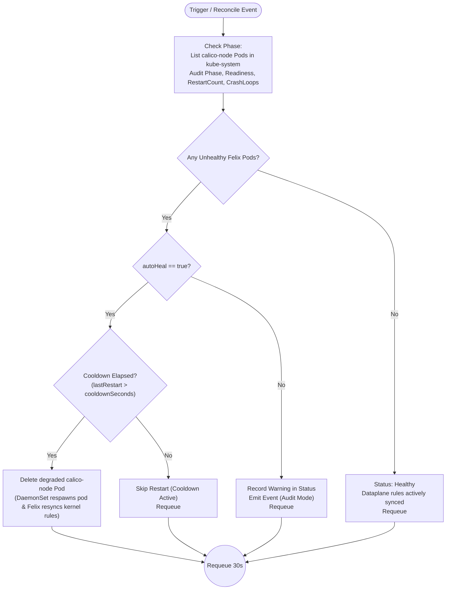

# NetworkPolicy Module: Enforcement Health & Dataplane Self-Healing Guide

This document provides a comprehensive explanation of the NetworkPolicy dataplane enforcement verification module within the **Network Remediation Operator**. It outlines the specific CNI enforcement failure mode handled by the operator, explains the architectural disconnect between the Kubernetes control plane and Linux kernel packet filtering, details the custom resource specification (`NetworkPolicySpec`), and explains the exact **Remediation Policy & Operator Workflow**.

---

## 1. The Core Networking Problem: Control Plane vs. Dataplane Disconnect

In Kubernetes, a `NetworkPolicy` resource is **declarative storage only**:
1. **Control Plane (`kube-apiserver` & `etcd`)**: Accepts and stores the YAML definition and emits watch events.
2. **Dataplane (Linux Kernel on each Node)**: Where network packets are physically evaluated and filtered via `iptables`, `ipsets`, or `eBPF` chains.
3. **The Enforcement Agent (Calico `felix`)**: Runs as a daemon inside each node's `calico-node` pod, watches the API server, and translates high-level Kubernetes policies into low-level Linux kernel packet-filtering rules.

### The Failure Mode: Stale Dataplane Enforcement (Experiment 3.3)

When the Calico enforcement agent (`felix`) process crashes, deadlocks on `xtables.lock`, or enters `CrashLoopBackOff` inside `calico-node`:
* **The Linux kernel packet-filtering rules freeze in place.**
* **Any new policy creations, updates, or deletions are silently ignored** by the kernel. Traffic that should be blocked remains permitted, or traffic that should be permitted remains dropped.
* **Kubernetes reports nothing wrong:** The API server continues to report that the `NetworkPolicy` objects are valid and active, and Kubernetes does not inspect whether kernel packet-filtering rules match declared policies.

| Failure Scenario | Root Cause | Kubernetes Built-in Behavior | Operator Remediation Action |
| :--- | :--- | :--- | :--- |
| **Stale Dataplane Enforcement** (Exp 3.3) | Calico's `felix` agent process crashes, deadlocks, or crashloops inside `calico-node`. | DaemonSet slowly retries pod restart; K8s never audits whether kernel rules are being programmed. | Monitors `calico-node` health (phase, container readiness, restart count `>= 3`, crashloops); automatically restarts degraded pods (with 60s cooldown) to force Felix to resynchronize kernel rules. |

---

## 2. NetworkPolicy Custom Resource Specification (`NetworkPolicySpec`)

The `NetworkPolicySpec` struct defined in [`operator/api/v1alpha1/networkpolicy_types.go`](../api/v1alpha1/networkpolicy_types.go) configures the monitoring parameters and remediation guardrails for the NetworkPolicy enforcement module within the `NetworkRemediation` custom resource definition (CRD).

### 2.1 Specification Field Reference Table

| Field | JSON Tag | Type | Default | Kubebuilder Marker | Purpose & Operational Usage |
| :--- | :--- | :--- | :--- | :--- | :--- |
| `Enabled` | `enabled` | `bool` | `true` | `+kubebuilder:default=true` | **Master Module Switch:** Enables or disables NetworkPolicy enforcement monitoring and remediation. When `false`, the reconciliation loop skips this module entirely. |
| `AutoHeal` | `autoHeal` | `bool` | `true` | `+kubebuilder:default=true`<br>`+optional` | **Autonomous Self-Healing Guardrail:** When `true`, automatically restarts degraded or crashlooping `calico-node` pods so Felix resynchronizes kernel rules. When `false`, operates in audit-only mode (status reporting & events only). |
| `CooldownSeconds` | `cooldownSeconds` | `int32` | `60` | `+kubebuilder:default=60`<br>`+optional` | **Restart Rate-Limiting Guardrail:** Specifies the minimum cooldown period in seconds between enforcement agent pod restarts to prevent control plane churn and pod flapping. |

---

### 2.2 In-Depth Field Usage & Operational Impact

#### 1. `enabled` (`bool`)
* **Usage:** Master switch to activate or deactivate the NetworkPolicy enforcement monitoring subsystem.
* **Why it matters:** Allows cluster administrators to temporarily silence automated controller actions during CNI upgrades, kernel updates, or node maintenance without needing to delete the entire `NetworkRemediation` resource or disable other functional modules (CNI, CoreDNS, PodConnectivity).
* **Controller Behavior:** If `spec.NetworkPolicy.Enabled == false`, the root reconciler skips the NetworkPolicy phase completely, avoiding API list queries and pod inspections.

#### 2. `autoHeal` (`bool`)
* **Usage:** Guardrail enabling or disabling automated restarts of degraded `calico-node` pods.
* **Why it matters:** Supports a "dry-run" or "auditing-only" mode. In sensitive environments, platform engineers may want the operator to detect and alert on stale enforcement while maintaining manual approval before terminating CNI pods.
* **Controller Behavior:**
  * In `Evaluate()`, if unhealthy enforcement pods are detected (`len(unhealthyFelix) > 0`), `evalResult.NeedsRemediation` takes the value of `autoHeal`.
  * If `autoHeal == true`: Controller returns `NeedsRemediation: true` and dispatches `ActionRestartFelix`.
  * If `autoHeal == false`: Controller updates the CR status and emits a Kubernetes Warning Event, but performs **no mutating pod deletions**.

#### 3. `cooldownSeconds` (`int32`)
* **Usage:** Configures the minimum duration (in seconds) that must elapse between consecutive enforcement agent pod restarts (default: `60s`).
* **Why it matters:** Deleting a DaemonSet pod triggers container re-creation, CNI binary re-initialization, and routing table recalculations. If a node is failing due to an underlying OS-level problem (e.g., corrupted kernel module or missing host binary), restarting the pod continuously would cause severe flapping and control plane churn.
* **Controller Behavior:** During `Remediate()`, the controller checks `time.Since(lastFelixRestart) < cooldownDuration`. If the cooldown has not elapsed, the restart is skipped and logged.

---

### 2.3 Example `NetworkRemediation` CRD Manifest

Below is an annotated YAML manifest demonstrating how `NetworkPolicySpec` is configured in a cluster:

```yaml
apiVersion: remediation.cn-operator.yuvraj-rathod-1202.github.io/v1alpha1
kind: NetworkRemediation
metadata:
  name: network-remediation-sample
  namespace: default
spec:
  networkPolicy:
    # Master switch: enable NetworkPolicy enforcement monitoring
    enabled: true

    # Automatically restart degraded calico-node pods to resync kernel rules
    autoHeal: true

    # Cooldown in seconds between restarts to prevent flapping
    cooldownSeconds: 60
```

---

## 3. Remediation Policy Workflow Diagram

The flowchart below illustrates the complete **Operator Workflow & Remediation Policy** for NetworkPolicy dataplane enforcement verification:



*Figure 1: NetworkPolicy Enforcement Remediation Workflow*

---

## 4. Workflow Step-by-Step Explanation

### Step 1: Check Phase & Telemetry Gathering
* **Trigger**: The operator's reconciliation loop runs periodically (every 30 seconds) or is triggered by watch events on `kube-system` pods.
* **Pod Audit**: The controller lists all pods in namespace `kube-system` matching label `k8s-app=calico-node`.
* For each pod, it evaluates:
  1. **Pod Phase**: Is `status.phase != PodRunning`?
  2. **Container Readiness**: Is any container `ready == false`?
  3. **Container Restarts**: Does any container have `restartCount >= 3`?
  4. **Container State**: Is any container waiting with reason `CrashLoopBackOff` or `Error`?
* Any pod matching these degradation criteria is flagged in `unhealthyFelixPods`.

### Step 2: Evaluation Phase & Decision
* If `len(unhealthyFelixPods) == 0`:
  * Returns `IsHealthy: true`, `NeedsRemediation: false`.
  * Records status: `"All <N> Calico enforcement agent pod(s) healthy; dataplane rules active"`.
* If `len(unhealthyFelixPods) > 0`:
  * Returns `IsHealthy: false`, `Severity: Warning`.
  * `NeedsRemediation` takes the value of `autoHeal`.
  * Sets action to `ActionRestartFelix` (`restart_enforcement_agent`).

### Step 3: Remediate Phase & DaemonSet Respawn
* If `ActionRestartFelix` is dispatched:
  1. Checks if `time.Since(lastFelixRestart) < cooldownDuration`.
  2. If on cooldown, logs the cooldown notice and safely exits without deleting.
  3. If cooldown has elapsed, issues `Client.Delete()` on the degraded `calico-node` pod.
  4. Updates `lastFelixRestart = time.Now()`.
* **The Recovery Mechanism:** Because `calico-node` is managed by a Kubernetes `DaemonSet`, deleting the pod causes the DaemonSet controller to immediately schedule a fresh, healthy pod on the node.
* On startup, Felix reads all declared policies from the Kubernetes API and programs the Linux kernel `iptables` and `ipset` chains from scratch, clearing stale state.

---

## 5. Summary of Controller Code Mapping

| Workflow Stage / Operation | Implementation File | Key Function / Method |
| :--- | :--- | :--- |
| **Check Phase & Pod Audit** | `operator/internal/controller/networkpolicy/controller.go` | `Check(ctx, spec)` |
| **List Calico-Node Pods** | `operator/internal/controller/networkpolicy/controller.go` | `Client.List(matchingLabels)` |
| **Evaluation Phase** | `operator/internal/controller/networkpolicy/controller.go` | `Evaluate(ctx, checkResult)` |
| **Remediation Dispatcher** | `operator/internal/controller/networkpolicy/controller.go` | `Remediate(ctx, evalResult)` |
| **Restart Enforcement Agent** | `operator/internal/controller/networkpolicy/controller.go` | `restartEnforcementAgent(ctx, eval)` |
| **Cooldown Rate-Limiting** | `operator/internal/controller/networkpolicy/controller.go` | `restartEnforcementAgent()` cooldown check |

---

## 6. Hands-On Verification Runbook (Experiment 3.3)

To test and verify the NetworkPolicy enforcement self-healing workflow against the experiment setup in [`experiments/networkpolicy-failure.md`](../../experiments/networkpolicy-failure.md):

### 1. Verify healthy baseline
Check that all `calico-node` pods are running and ready:
```bash
kubectl get pods -n kube-system -l k8s-app=calico-node
```

### 2. Simulate failure: Kill Felix process inside calico-node
Identify a `calico-node` pod and kill the `felix` process:
```bash
CALICO_POD=$(kubectl get pods -n kube-system -l k8s-app=calico-node -o jsonpath='{.items[0].metadata.name}')
kubectl exec -n kube-system $CALICO_POD -- pkill -f felix
```

### 3. Observe operator detection and remediation
Within ~30 seconds, the operator detects the degraded/restarting pod and restarts it cleanly:
```bash
# Check operator logs
kubectl logs -n default -l control-plane=controller-manager -c manager --tail=30
```
You will see:
```text
Restarted 1 calico-node pod(s) to resync policy enforcement: kube-system/calico-node-...
```

### 4. Verify dataplane recovery
Confirm that the new `calico-node` pod is running and healthy:
```bash
kubectl get pods -n kube-system -l k8s-app=calico-node
```
The newly spawned Felix agent immediately resynchronizes all kernel packet-filtering rules.
