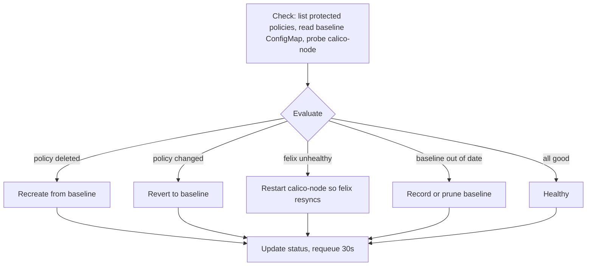

# NetworkPolicy Remediation Module

## The gap in Kubernetes

Kubernetes treats a `NetworkPolicy` as **declarative storage only**: it just
stores the YAML and hands it to the CNI (Calico). It never verifies that the
policy is actually enforced, and it raises no alert if a policy is deleted or
changed. So these failures go completely unhealed (see
[`experiments/networkpolicy-failure.md`](../../experiments/networkpolicy-failure.md)):

| Failure | What happens | Kubernetes response |
|---------|--------------|---------------------|
| **Policy deleted** (Exp 3.2) | A `deny` policy is removed; blocked traffic silently starts flowing | Removes it from etcd, no alert |
| **Policy drift** | A protected policy's rules are edited away from the intended state | Accepts the change, no alert |
| **Stale enforcement** (Exp 3.3) | Calico's `felix` agent crashes; iptables rules go stale, new changes not applied | Restarts the pod, never verifies enforcement |

## What this module does

It protects every `NetworkPolicy` that carries the label
`remediation.cn-operator.yuvraj-rathod-1202.github.io/protected: "true"`. It
snapshots their intended spec into a baseline `ConfigMap`
(`kube-system/networkpolicy-baseline`) and then continuously heals the three
failures above.

### Check → Evaluate → Remediate



**Detection priority** (highest first): deleted → drifted → stale enforcement →
baseline maintenance. Deletion and drift only auto-heal when `autoRestore: true`
(otherwise they are reported but not changed). Enforcement-agent restarts are
rate-limited by a 60s cooldown to avoid thrashing.

### How it knows the "correct" state

On the first reconcile after a policy is labelled protected, the module records
its current spec as the baseline (a benign `sync_baseline` action). From then on
that baseline is the source of truth: any deletion is recreated from it and any
drift is reverted to it. Removing the protected label prunes the baseline entry.

## Configuration (`NetworkRemediationSpec.networkPolicy`)

| Field | Default | Meaning |
|-------|---------|---------|
| `enabled` | `true` | Turn the module on/off |
| `protectedLabel` | `remediation.cn-operator.yuvraj-rathod-1202.github.io/protected` | Label key that marks a policy as protected |
| `snapshotNamespace` | `kube-system` | Namespace of the baseline ConfigMap |
| `snapshotConfigMapName` | `networkpolicy-baseline` | Name of the baseline ConfigMap |
| `autoRestore` | `true` | Auto-recreate deleted and revert drifted policies |
| `verifyEnforcement` | `true` | Also watch calico-node/felix health |

## Try it (against the experiment workloads)

```bash
# 1. label the deny-all policy so the operator protects it
kubectl label networkpolicy deny-all-ingress \
  remediation.cn-operator.yuvraj-rathod-1202.github.io/protected=true

# 2. let the operator snapshot the baseline (one reconcile), then delete it
kubectl delete networkpolicy deny-all-ingress

# 3. within ~30s the operator recreates it; the blocked client is blocked again
kubectl get networkpolicy deny-all-ingress
```
