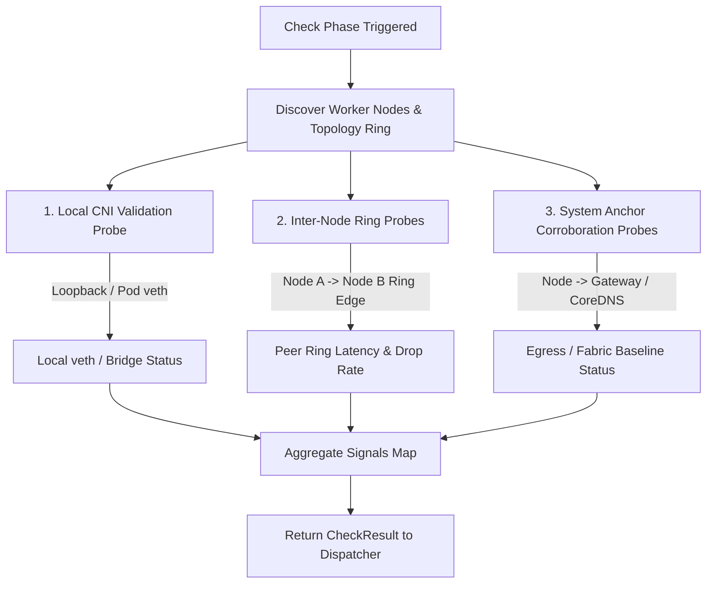
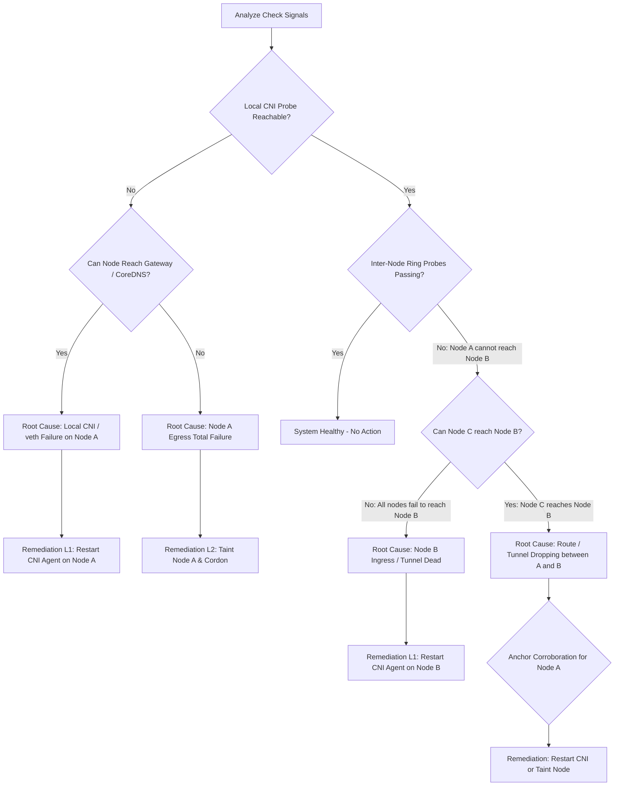

# Pod-to-Pod Connectivity Monitoring & Remediation Operator

## 1. Executive Summary & Problem Statement

In Kubernetes clusters, pod-to-pod network integrity is fundamental to microservice availability. However, native Kubernetes primitives offer no continuous network-layer probing:
- The `kubelet` monitors container processes via readiness and liveness probes, but these only assert that a local process can respond on a port—not that the virtual network fabric can deliver cross-node or intra-node traffic.
- When an underlying network component breaks (such as a dropped `veth` interface, a corrupted `iptables`/`eBPF` rule, a crashed overlay tunnel `tunl0`/`flannel.1`, or an unresponsive CNI agent like `calico-node`), Kubernetes leaves the affected pods in `Running (1/1 Ready)` and nodes in `Ready`.
- Application requests time out or fail silently, leading to cascading failures across services without automated self-healing.

A naive monitoring approach of having every pod probe every other pod introduces an $O(M^2)$ traffic explosion (where $M$ is total pod count), inducing severe network congestion and probe-induced false positives. Similarly, a full-mesh node-to-node probe requires $O(N^2)$ connections (where $N$ is worker node count).

This operator implements an industrial-grade, deterministic pod-to-pod connectivity monitoring and remediation architecture adapting Microsoft's **Pingmesh** design principles into a **Controller-Orchestrated** design. It establishes two scalable monitoring boundaries:
1. **Inter-Node Fabric & Overlay Monitoring ($O(N)$ Scalability)**: An active topological ring with bidirectional edges dynamically orchestrated by the operator controller across worker nodes ($Node_i \to Node_{(i+1) \bmod N}$ and $Node_i \to Node_{(i-1) \bmod N}$).
2. **Intra-Node / Local CNI Validation ($O(1)$ per Node)**: Direct host/pod namespace verification against local canary/application pods on each node, verifying local `veth` plumbing, routing, and CoreDNS availability without application pod interference.

> **Key Architectural Principle: Controller-Orchestrated Probing**  
> Probing is orchestrated directly by the central Network Remediation Operator controller. **No external `node-prober` DaemonSet pod is deployed or required.** This keeps the deployment lightweight, eliminates container registry image dependencies for probers, and provides seamless operation across both local development environments (Kind, Minikube) and enterprise clusters.

Combined with a **Three-Tier Evaluation and Pattern Triangulation Engine** and a **Hierarchical Automated Remediation Policy**, the operator eliminates false positives, pinpoints the root cause, and applies minimal-blast-radius corrective actions (local CNI restart $\to$ node taint/cordon $\to$ workload eviction/drain).

---

## 2. High-Level Architecture

The system decouples data collection, root-cause triangulation, and declarative remediation:

```
+-----------------------------------------------------------------------+
|                      Network Remediation Operator                     |
|                                                                       |
|  +--------------------+   +---------------------+   +---------------+ |
|  |    Check Phase     |-->|   Evaluate Phase    |-->|Remediate Phase| |
|  | (Ring/Local Probes)|   | (3-Tier Triangulate)|   |(Restart/Drain)| |
|  +--------------------+   +---------------------+   +---------------+ |
+-----------------------------------+-----------------------------------+
                                    |
           +------------------------+------------------------+
           |                                                 |
           v                                                 v
+-----------------------+                         +-----------------------+
|     Worker Node A     |  Inter-Node Probe (TCP) |     Worker Node B     |
|                       | <=====================> |                       |
|                       |     (Pingmesh Ring)     |                       |
|   +---------------+   |                         |   +---------------+   |
|   |  Canary / App |   |                         |   |  Canary / App |   |
|   |      Pod      |   |                         |   |      Pod      |   |
|   +-------+-------+   |                         |   +-------+-------+   |
|           |           |                         |           |           |
|     Local | (veth)    |                         |     Local | (veth)    |
|     Probe |           |                         |     Probe |           |
|           v           |                         |           v           |
|   calico-node / CNI   |                         |   calico-node / CNI   |
+-----------------------+                         +-----------------------+
```

### Architectural Components

1. **Network Remediation Operator (Controller Manager)**:
   - Runs as a cluster-scoped deployment.
   - Watches `NetworkRemediation` custom resources.
   - Implements the `module.Module` interface (`Check` $\to$ `Evaluate` $\to$ `Remediate`).
   - Dynamically discovers worker nodes and constructs the Pingmesh $O(N)$ active ring topology.
   - Orchestrates synthetic inter-node and intra-node health probes directly via Kubernetes API / exec / HTTP / TCP transports.
   - Executes multi-tier pattern triangulation to isolate failures.
   - Dispatches declarative remediation actions (CNI pod restart, node taints, workload drain) via the Kubernetes API.

2. **Canary / Application Pods (Targets)**:
   - Workload or canary pods (e.g., `backend-api` or dedicated canary pods) running inside the standard pod network namespace on each node.
   - Used to validate that virtual ethernet pairs (`veth`), bridge forwarding, and overlay tunnels (`tunl0`, VXLAN) can deliver traffic to/from the pod network on that node.

3. **CNI Subsystem DaemonSet (`calico-node` / `kindnet`)**:
   - The cluster CNI agent managing node routing tables, virtual interfaces, and firewall rules (`iptables` / `eBPF`).

---

## 3. Operator Check Policy

The **Check Policy** defines the telemetry-gathering protocol, topology layout, and timing intervals. No remediation decisions are made during this phase.



### 3.1 Probing Topologies & Scalability

#### Ring Topology ($O(N)$)
For clusters with $N$ worker nodes ($N \ge 2$), the operator sorts the nodes deterministically (lexicographically by node name). An active ring is established:
$$\text{Forward Edge: } Node_i \to Node_{(i+1) \bmod N}$$
$$\text{Reverse Edge: } Node_i \to Node_{(i-1+N) \bmod N} \quad (N \ge 3)$$

This guarantees that every node has both ingress and egress paths under continuous validation with exactly $2N$ total probes across the entire cluster, completely eliminating $O(N^2)$ probe saturation.

#### Intra-Node Canary Validation ($O(1)$ per Node)
On each node, the operator validates the local network namespace crossing (`veth` pair $\to$ host bridge $\to$ `iptables` FORWARD chain) by probing the local pod endpoint. This asserts that the local CNI subsystem is functional without probing every single application pod on the node.

#### Small Cluster Topology ($N \le 2$)
In 1-node or 2-node environments (e.g., Minikube, local test clusters, edge appliances), cross-node triangulation is supplemented by static **System Anchors** (Cloud Gateway, CoreDNS Service IP, or `kube-apiserver`) to isolate node-local network stack failures from peer ingress issues.

### 3.2 Dual Boundary Probing Specification

| Boundary | Source | Target | Protocol | Target Interface / Path Validated |
| :--- | :--- | :--- | :--- | :--- |
| **Intra-Node (Local CNI)** | Operator | Local Pod on Node $A$ | TCP / ICMP | Local `vethX` pair, bridge routing, IPAM allocation, local iptables `FORWARD` |
| **Intra-Node (DNS Anchor)**| Operator | CoreDNS Service IP | UDP / DNS / TCP | `kube-dns` iptables / IPVS virtual server rules |
| **Inter-Node (Ring)** | Pod on Node $A$ | Pod on Node $B$ | TCP SYN / ICMP | Physical NIC, underlay fabric, MTU sizing, IPIP (`tunl0`) / VXLAN encapsulation |
| **System Anchor** | Pod on Node $A$ | Cloud Gateway / APIServer | TCP / ICMP | Default route egress, physical top-of-rack (ToR) switch |

### 3.3 Probing Parameters

- **Probe Frequency (`intervalSeconds`)**: Default 10 seconds (configurable 2s–300s).
- **Timeout (`timeoutSeconds`)**: Default 2 seconds (configurable 1s–30s).
- **Probe Protocol (`probeProtocol`)**: `tcp` or `http` (default: `tcp`).
- **Probe Port (`probePort`)**: Default 9099.
- **Retry Window (`consecutiveFailureThreshold`)**: Default 2–3 consecutive failed reconciliations before declaring an edge degraded (suppresses transient jitter).

---

## 4. Operator Evaluate Policy (Three-Tier Triangulation)

The **Evaluate Policy** analyzes raw signals gathered during the Check phase. It eliminates transient false positives, classifies problem severity, and determines whether automated remediation is strictly necessary.



### 4.1 Evaluation Tiers

#### Tier 1: Intra-Node / Local CNI Validation
- **Condition**: Node $A$'s local probe to its same-node pod fails, but Node $A$ can communicate with its default gateway or external endpoints.
- **Root Cause**: The physical host network is operational, but the local CNI subsystem is damaged. Typical causes:
  - Pod `veth` interface administratively `DOWN` or unplugged.
  - Corrupted iptables `FORWARD` chain or Calico/Cilium eBPF map corruption.
  - Stale routing table entries in the network namespace.
- **Classification**: `FailureTypeLocalCNI` on Node $A$.
- **Severity**: `Critical`.

#### Tier 2: Inter-Node Triangulation
When Node $A$ detects packet loss or timeout when probing Node $B$ ($A \not\to B$), the operator interrogates telemetry from other vantage points:

| Node $A \to$ Node $B$ | Node $C \to$ Node $B$ | Node $A \to$ Node $C$ | Isolated Root Cause | Severity |
| :--- | :--- | :--- | :--- | :--- |
| **FAIL** | **PASS** | **PASS** | Asymmetric tunnel/route drop between Node $A$ and Node $B$. Node $B$ is healthy. Node $A$'s egress tunnel routing or intermediary switch path is corrupted. | `Warning` / `Critical` |
| **FAIL** | **FAIL** | **PASS** | Node $B$'s ingress network stack, `tunl0` interface, physical NIC, or host firewall is completely dead (`NodeIngressDead`). | `Critical` |
| **FAIL** | **PASS** | **FAIL** | Node $A$'s general egress is failing. Node $A$ cannot transmit across the cluster fabric (`NodeEgressDead`). | `Critical` |
| **FAIL** | **FAIL** | **FAIL** | Network partition, core switch failure, or multiple host network crashes. | `Emergency` |

#### Tier 3: Anchor Corroboration
Designed specifically for clusters where node count $N < 3$ or when triangulation yields ambiguous results:
- If Node $A \not\to$ Node $B$, Node $A$ validates connectivity against a high-availability **System Anchor** (Default Gateway, CoreDNS Service IP, or the Kubernetes API Server).
- If Node $A \to \text{Anchor}$ **PASSES**, Node $A$'s physical interface and local egress are proven functional, confirming the problem lies in the inter-node tunnel or the target host.
- If Node $A \to \text{Anchor}$ **FAILS**, Node $A$ is suffering from a complete host network outage.

---

## 5. Custom Resource Definition (CRD) Architecture

The operator configuration is embedded within the existing `NetworkRemediation` CRD under the `spec.podConnectivity` block.

### 5.1 YAML Specification Sample

```yaml
apiVersion: remediation.cn-operator.yuvraj-rathod-1202.github.io/v1alpha1
kind: NetworkRemediation
metadata:
  name: networkremediation-sample
  namespace: default
spec:
  podConnectivity:
    enabled: true
    targetNamespace: "default"
    
    # Probing & Topology Policy (Pingmesh O(N) ring + local CNI)
    checkPolicy:
      topology: "ring"                # Options: ring, mesh, sampled
      intervalSeconds: 10
      timeoutSeconds: 2
      probeProtocol: "tcp"            # Options: tcp, http
      probePort: 9099
      anchors:
        - name: "cloud-gateway"
          address: "192.168.49.1"
          protocol: "icmp"
        - name: "kubernetes-apiserver"
          address: "10.96.0.1"
          port: 443
          protocol: "tcp"

    # Evaluation & Pattern Triangulation Policy
    evaluatePolicy:
      triangulationEnabled: true
      anchorCorroborationEnabled: true
      localCNIValidationEnabled: true
      consecutiveFailureThreshold: 2
      packetLossThresholdPercent: 20

    # Automated Hierarchical Remediation Policy
    remediationPolicy:
      autoRemediationEnabled: true
      cniSubsystem:
        enabled: true
        daemonSetName: "calico-node"   # Default CNI DaemonSet
        namespace: "kube-system"
        maxRestartAttempts: 2
        restartBackoffSeconds: 60
      nodeIsolation:
        taintNode: true
        taintKey: "network-degraded"
        taintValue: "true"
        taintEffect: "NoSchedule"
        cordonNode: true
      nodeDrain:
        enabled: true
        escalateAfterFailedRestarts: 2
        drainTimeoutSeconds: 120
        deleteEmptyDirData: true
        ignoreDaemonSets: true
```

### 5.2 Go Struct Definitions (`api/v1alpha1/podconnectivity_types.go`)

```go
package v1alpha1

// PodConnectivitySpec configures the pod-to-pod and inter-node connectivity module.
type PodConnectivitySpec struct {
	// Enabled toggles the pod connectivity monitoring module.
	// +kubebuilder:default=true
	Enabled bool `json:"enabled"`

	// TargetNamespace is the namespace where probing pods or responders are located.
	// +kubebuilder:default="default"
	// +optional
	TargetNamespace string `json:"targetNamespace,omitempty"`

	// CheckPolicy configures probing mechanics, topology, and probe intervals.
	// +optional
	CheckPolicy CheckPolicySpec `json:"checkPolicy,omitempty"`

	// EvaluatePolicy configures triangulation thresholds and anchor validation.
	// +optional
	EvaluatePolicy EvaluatePolicySpec `json:"evaluatePolicy,omitempty"`

	// RemediationPolicy specifies automated healing steps and escalation limits.
	// +optional
	RemediationPolicy RemediationPolicySpec `json:"remediationPolicy,omitempty"`
}

// CheckPolicySpec defines how the probing layer executes.
type CheckPolicySpec struct {
	// Topology defines the probing graph: "ring", "mesh", or "sampled".
	// +kubebuilder:default="ring"
	// +kubebuilder:validation:Enum=ring;mesh;sampled
	// +optional
	Topology string `json:"topology,omitempty"`

	// IntervalSeconds is how frequently probes execute.
	// +kubebuilder:default=10
	// +kubebuilder:validation:Minimum=2
	// +kubebuilder:validation:Maximum=300
	// +optional
	IntervalSeconds int `json:"intervalSeconds,omitempty"`

	// TimeoutSeconds specifies timeout for each synthetic probe.
	// +kubebuilder:default=2
	// +kubebuilder:validation:Minimum=1
	// +kubebuilder:validation:Maximum=30
	// +optional
	TimeoutSeconds int `json:"timeoutSeconds,omitempty"`

	// ProbeProtocol specifies network protocol: "tcp" or "http".
	// +kubebuilder:default="tcp"
	// +kubebuilder:validation:Enum=tcp;http
	// +optional
	ProbeProtocol string `json:"probeProtocol,omitempty"`

	// ProbePort is the port on which the probe agent and responders listen.
	// +kubebuilder:default=9099
	// +optional
	ProbePort int `json:"probePort,omitempty"`

	// Anchors defines static external anchors for corroboration.
	// +optional
	Anchors []AnchorTarget `json:"anchors,omitempty"`
}

// AnchorTarget defines a static anchor for out-of-band triangulation.
type AnchorTarget struct {
	Name     string `json:"name"`
	Address  string `json:"address"`
	Port     int    `json:"port,omitempty"`
	Protocol string `json:"protocol,omitempty"` // "tcp", "udp", "icmp"
}

// EvaluatePolicySpec configures failure classification and triangulation rules.
type EvaluatePolicySpec struct {
	// TriangulationEnabled enables cross-node triangulation.
	// +kubebuilder:default=true
	// +optional
	TriangulationEnabled bool `json:"triangulationEnabled,omitempty"`

	// AnchorCorroborationEnabled enables verification against static system anchors.
	// +kubebuilder:default=true
	// +optional
	AnchorCorroborationEnabled bool `json:"anchorCorroborationEnabled,omitempty"`

	// LocalCNIValidationEnabled enables host-to-pod loopback verification.
	// +kubebuilder:default=true
	// +optional
	LocalCNIValidationEnabled bool `json:"localCNIValidationEnabled,omitempty"`

	// ConsecutiveFailureThreshold specifies how many probe failures confirm an issue.
	// +kubebuilder:default=3
	// +optional
	ConsecutiveFailureThreshold int `json:"consecutiveFailureThreshold,omitempty"`

	// PacketLossThresholdPercent defines degradation threshold.
	// +kubebuilder:default=20
	// +optional
	PacketLossThresholdPercent int `json:"packetLossThresholdPercent,omitempty"`
}

// RemediationPolicySpec governs automated recovery actions.
type RemediationPolicySpec struct {
	// AutoRemediationEnabled permits the operator to execute corrective actions.
	// +kubebuilder:default=true
	// +optional
	AutoRemediationEnabled bool `json:"autoRemediationEnabled,omitempty"`

	// CNISubsystem configures restarts of the node's local CNI agent.
	// +optional
	CNISubsystem CNISubsystemRemediation `json:"cniSubsystem,omitempty"`

	// NodeIsolation configures taints and cordoning for degraded nodes.
	// +optional
	NodeIsolation NodeIsolationRemediation `json:"nodeIsolation,omitempty"`

	// NodeDrain configures workload eviction when lower tiers fail.
	// +optional
	NodeDrain NodeDrainRemediation `json:"nodeDrain,omitempty"`
}

// CNISubsystemRemediation configures CNI pod restarts.
type CNISubsystemRemediation struct {
	// Enabled allows restarting local CNI DaemonSet pod.
	// +kubebuilder:default=true
	// +optional
	Enabled bool `json:"enabled"`

	// DaemonSetName is the name of the CNI DaemonSet (e.g. "calico-node", "kindnet").
	// +kubebuilder:default="calico-node"
	// +optional
	DaemonSetName string `json:"daemonSetName,omitempty"`

	// Namespace is the namespace where the CNI DaemonSet lives.
	// +kubebuilder:default="kube-system"
	// +optional
	Namespace string `json:"namespace,omitempty"`

	// MaxRestartAttempts is the maximum attempts before escalating to drain.
	// +kubebuilder:default=2
	// +optional
	MaxRestartAttempts int `json:"maxRestartAttempts,omitempty"`

	// RestartBackoffSeconds is cooldown between restarts.
	// +kubebuilder:default=60
	// +optional
	RestartBackoffSeconds int `json:"restartBackoffSeconds,omitempty"`
}

// NodeIsolationRemediation configures taints and cordoning.
type NodeIsolationRemediation struct {
	// TaintNode adds a taint to faulty nodes.
	// +kubebuilder:default=true
	// +optional
	TaintNode bool `json:"taintNode"`

	// TaintKey is the taint key applied to degraded nodes.
	// +kubebuilder:default="network-degraded"
	// +optional
	TaintKey string `json:"taintKey,omitempty"`

	// TaintValue is the value of the taint.
	// +kubebuilder:default="true"
	// +optional
	TaintValue string `json:"taintValue,omitempty"`

	// TaintEffect is the effect applied (NoSchedule, PreferNoSchedule).
	// +kubebuilder:default="NoSchedule"
	// +optional
	TaintEffect string `json:"taintEffect,omitempty"`

	// CordonNode marks the node unschedulable.
	// +kubebuilder:default=true
	// +optional
	CordonNode bool `json:"cordonNode"`
}

// NodeDrainRemediation configures safe eviction.
type NodeDrainRemediation struct {
	// Enabled permits node draining.
	// +kubebuilder:default=true
	// +optional
	Enabled bool `json:"enabled"`

	// EscalateAfterFailedRestarts triggers drain after CNI restarts fail.
	// +kubebuilder:default=2
	// +optional
	EscalateAfterFailedRestarts int `json:"escalateAfterFailedRestarts,omitempty"`

	// DrainTimeoutSeconds is eviction timeout.
	// +kubebuilder:default=120
	// +optional
	DrainTimeoutSeconds int `json:"drainTimeoutSeconds,omitempty"`

	// DeleteEmptyDirData allows eviction of pods with emptyDir volumes.
	// +kubebuilder:default=true
	// +optional
	DeleteEmptyDirData bool `json:"deleteEmptyDirData,omitempty"`

	// IgnoreDaemonSets skips DaemonSet pods during eviction.
	// +kubebuilder:default=true
	// +optional
	IgnoreDaemonSets bool `json:"ignoreDaemonSets,omitempty"`
}
```

---

## 6. Automated Remediation Policy

When triangulation confirms a network anomaly, the operator executes a **scoped, tiered remediation policy**. Actions escalate only if previous tiers fail to restore connectivity:

```
+-------------------------------------------------------+
|             Failure Validated by Operator             |
+---------------------------+---------------------------+
                            |
           +----------------+----------------+
           |                                 |
           v                                 v
   [Local CNI / veth Drop]        [Inter-Node / Fabric Failure]
           |                                 |
           v                                 v
+-----------------------+         +-----------------------+
|  Tier 1: Restart CNI  |         |  Tier 2: Taint &      |
|  Pod on Affected Node |         |  Cordon Node          |
+-----------+-----------+         +-----------+-----------+
            |                                 |
            v (If Unresolved)                 v (If Unresolved)
+---------------------------------------------------------+
|     Tier 3: Safe Workload Eviction (kubectl drain)      |
|           & Reschedule onto Healthy Nodes               |
+---------------------------------------------------------+
```

### 6.1 Tier 1: CNI Subsystem Remediation
- **Applicability**: Local CNI failure, dropped `veth` interface, or IPIP tunnel crash on a specific node.
- **Action**:
  1. Identifies the local CNI DaemonSet pod on the affected node (e.g., `calico-node-xxxxx` in `kube-system`).
  2. Issues a Kubernetes API delete request for that specific pod.
  3. The DaemonSet controller automatically recreates the pod with a fresh network initialization cycle.
  4. The restarting CNI agent flushes stale routing tables, resets the `tunl0`/`vxlan.calico` virtual interfaces, rebinds veth pairs, and reloads `iptables`/`eBPF` state.
- **Backoff & Limits**: Limited to `maxRestartAttempts` (default: 2) within a sliding window. If connectivity is not restored, the operator escalates to Tier 2 and Tier 3.

### 6.2 Tier 2: Targeted Tainting and Cordoning
- **Applicability**: Persistent cross-node packet loss, asymmetric drops, or flaky physical interfaces.
- **Action**:
  1. Patches the Kubernetes `Node` resource with a taint:
     ```yaml
     key: network-degraded
     value: "true"
     effect: NoSchedule
     ```
  2. Marks the node unschedulable (`spec.unschedulable = true`).
- **Outcome**: The Kubernetes scheduler immediately stops scheduling new workloads onto the degraded host while preserving existing healthy workloads for non-disruptive inspection.

### 6.3 Tier 3: Workload Drain & Rescheduling
- **Applicability**: Unresolved CNI failure after max restarts, complete NIC failure, or total anchor unreachable state.
- **Action**:
  1. Safely evicts non-DaemonSet application pods from the node using the Kubernetes Eviction API.
  2. Respects `PodDisruptionBudgets` (PDBs) to ensure high-availability guarantees.
  3. Enforces a drain timeout (default: 120 seconds).
  4. Workloads are gracefully rescheduled by their parent controllers (Deployments, StatefulSets) onto healthy worker nodes.

---

## 7. Failure Scenarios & Operator Behavior Matrix

| Failure Mode (Real-world Scenario) | Check Signal Observed | Triangulation Classification | Automated Remediation Action | Post-Remediation State |
| :--- | :--- | :--- | :--- | :--- |
| **Pod `veth` Down** (`ip link set caliXXXX down`) | Local canary probe on Node $A$ fails ($O(1)$). Inter-node ring is healthy. | **Tier 1**: Local CNI failure on Node $A$. | Operator restarts `calico-node` on Node $A$. CNI reconciler re-establishes veth interfaces. | Local canary reachable; module status becomes `Healthy`. |
| **IPIP Tunnel Crash** (`ip link set tunl0 down`) | Ring probe from Node $A \to$ Node $B$ times out. Node $C \to$ Node $B$ also times out. Local CNI probes pass on both nodes. | **Tier 2**: Node $B$'s ingress tunnel is unresponsive. | Operator restarts `calico-node` on Node $B$. | `tunl0` interface re-initialized; cross-node pings resume. |
| **iptables DROP Rule** (`iptables -I FORWARD -j DROP`) | Outbound ring probes fail. Anchor probes fail. Local canary unreachable. | **Tier 1 & 2**: Total network stack block on Node $A$. | Operator attempts CNI pod restart (flushes iptables). If rule persists, taints and cordons Node $A$. | Workloads protected from scheduling onto broken node. |
| **Physical Cable Pull / NIC Flap** | All external probes from Node $A$ fail. All external probes to Node $A$ fail. | **Tier 2 & 3**: Node $A$ isolated from fabric. | Operator taints Node $A$ (`network-degraded:NoSchedule`), cordons, and initiates safe workload eviction. | Application pods rescheduled onto healthy nodes. |

---

## 8. Integration into Controller Pipeline

The pod connectivity module integrates cleanly with the existing dispatcher (`internal/controller/networkremediation_controller.go`):
1. **Dispatcher Invocation**: Every `requeueInterval` (30s), dispatcher invokes `Check(ctx, spec)`.
2. **Signal Synthesis**: `Check` executes ring probes, local canary checks, and anchor health into `checkResult.Signals`.
3. **Triangulation Engine**: `Evaluate(ctx, checkResult)` analyzes the signal graph and decides if remediation is required.
4. **Remediation Execution**: `Remediate(ctx, evalResult)` carries out the progressive actions (CNI restart, taint/cordon, drain).
5. **Status Reconciliation**: Updates the `NetworkRemediation` CR status to provide complete cluster visibility.
